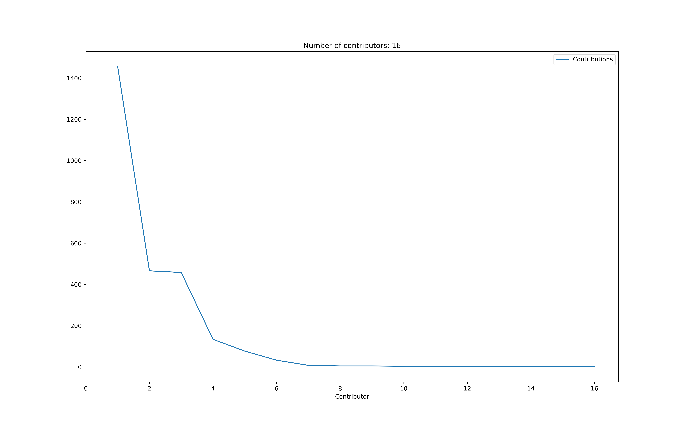

# popularipy
A little Python package to access popularity metrics for your package. Feel free to contribute!

- [x] Downloads history from Pypi
- [x] Stars history from GitHub
- [x] Number of GitHub contributors
- [ ] GitHub traffic history from GitHub (See https://github.com/seladb/github-traffic-stats)

## Installation

```
pip install https://github.com/DominiqueMakowski/popularipy/zipball/master
```

## Demo

Example for the [`NeuroKit`](https://github.com/neuropsychology/NeuroKit) package.
```python
import popularipy

# Pypi downloads
downloads = popularipy.pypi_downloads("neurokit2")
downloads.plot(x="Date")

# GitHub stars
stars = popularipy.github_stars("neuropsychology/neurokit", "myaccesstoken")
stars.plot(x="Date")
```

Combine the data:

```python
import pandas as pd

data = downloads.merge(stars)
data.plot.area(x="Date", y=["Downloads", "Stars"], subplots=True)
```


Number of contributors and amount of contributions:

```python
# Get Contributors
contributors = popularipy.github_contributors("neuropsychology/neurokit", myaccesstoken)
contributors["Contributor"] = range(1, len(contributors) + 1)  # Anonimize contributors

# Plot
contributors.plot(x="Contributor", y="Contributions")
plt.xlim(left=0)
plt.title("Number of contributors: " + str(len(contributors)))
```

